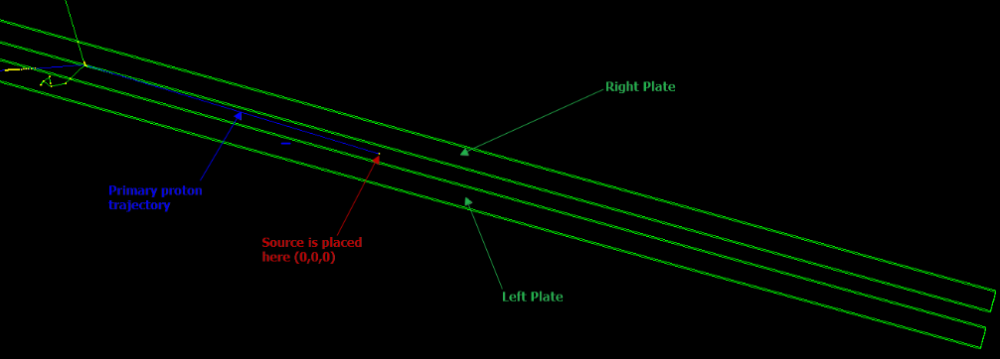

Counting Particles in *Geant4*
==============================
A simple simulation in *Geant4*, to count the unique particles detected inside a *sensitive* volume. <br />
*Note* : This simulation is intented to run on *Geant4* installed in *sequential mode*.

Geometry
========
The geometry of the simulation is very simple: two parallel plates (*Right Plate and Left Plate*) made of *Aluminum 6061*. The dimensions of each plate are *600 x 20 x 5 cm (x,y,z)*. There is also a uniform electric field in between them, set to *4.5 MV/m*. The center of each plate is at *150, 0, ±4.5 cm (x,y,z)*.

Source
======
The source is point-like and placed at the origin of the global coordinate system. From there, we shoot *protons* one-by-one, at a fixed angle towards the *Right Plate*. The angle we shoot the *protons* is *φ=1.5°* with respect to the *x-axis* and the momentum of the protons is set to *p=700 MeV/c*.

<div align="center">
    
</div>

How to run?
===========
Assuming you are in a folder that contains this project in a folder named *Counting Particles*, open a terminal, then:

``` sh
mkdir build && cd build
cmake ../Counting Particles
make
./Counting_Particles
```

To run the simulation in batch mode, you need to manually copy the *batch_mode_macro.mac* located at *macros* folder, to the *build* folder. After using *cmake* and *make* to build the project (like shown above):

``` sh
./Counting_Particles batch_mode_macro.mac
```

How to check the results of the simulation?
===========================================
Inside the *macros* folder there is a collection of scripts, designed to visualize the results of the simulation. You need to have [ROOT](https://root.cern/) installed to use those.
Also, you must manually copy them from the *macros* folder to the *build* folder, along with *root_helper.hh*.

After running the simulation, there must be a file named *results.root* inside the *build* folder. <br />
Copy the scripts along with *root_helper.hh* from *macros* folder to *build* folder, open a terminal in *build* folder:

``` sh
root -l name_of_the_script.cc
```
Replace the name_of_the_script with the appropriate name of the copied .cc file.

Dependencies
============
- [Geant4](https://geant4.web.cern.ch/) installed in sequential mode
- [ROOT](https://root.cern/)
